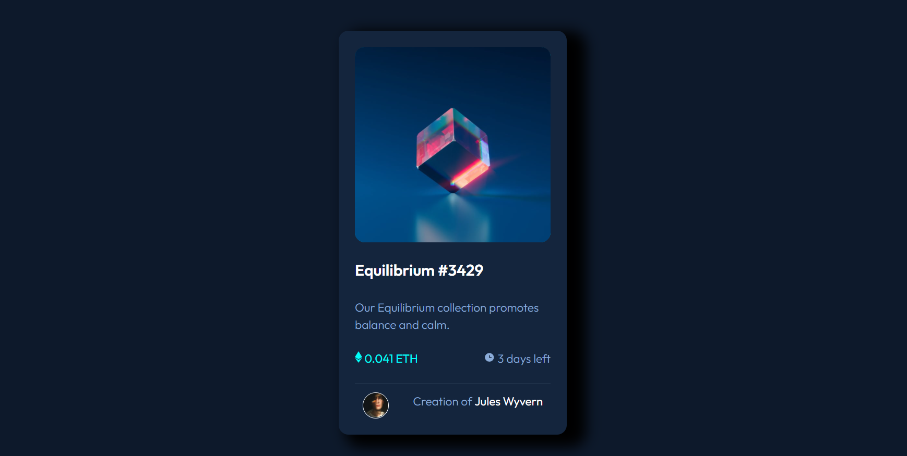

# NFT-Prieview-Card-HTML-CSS
HTML CSS Challenge from front End Mentor
# Frontend Mentor - NFT preview card component solution

This is a solution to the [NFT preview card component challenge on Frontend Mentor](https://www.frontendmentor.io/challenges/nft-preview-card-component-SbdUL_w0U). Frontend Mentor challenges help you improve your coding skills by building realistic projects. 

## Table of contents

- [Overview](#overview)
  - [The challenge](#the-challenge)
  - [Screenshot](#screenshot)
  - [Links](#links)
- [My process](#my-process)
  - [Built with](#built-with)
  - [What I learned](#what-i-learned)
  - [Continued development](#continued-development)
- [Author](#author)
- [Acknowledgments](#acknowledgments)

## Overview

### The challenge

Users should be able to:

- View the optimal layout depending on their device's screen size.
- See hover states for interactive elements (lastname, company name, image).

### Screenshot

### Links
- Live Site URL: [To View Live Site](https://slimbloodworth.github.io/NFT-Prieview-Card-HTML-CSS/)

## My process

I started with sectioning it out for the mobile view from the outside using utiliy classes. I wanted to get the structure and other elements in place before I started working on the interactive elements.

### Built with

- HTML5
- CSS3
- Flexbox
- Mobile-first responsive workflow

### What I learned

I really got into using utility classes on this one and cleaning up the code. I the most challenging portion of this project was getting the incon-view.svg to center, and I chased it all over the screen for a few hours. In researching some code from others who have compepleted this challenge I expanded my understanding positioning items as well as inteactive aspects and various ways they can be implenented.

### Continued development
I'm looking to use some of the things I picked up from this project to play more with interactive aspects.
I'm always looking on feedback on best practices, better drying out the code, and constructive feedback is welcome and appreciated!

## Author

- Website - [Michelle Renee - Creative Software Developer](https://slimbloodworth.editorx.io/portfolio)
- Frontend Mentor - [@SlimBloodworth](https://www.frontendmentor.io/profile/SlimBloodworth)
- CodePen - [@slimbloodworth](https://codepen.io/slimbloodworth)
- LinkedIn - [Michelle Renee](https://www.linkedin.com/in/michelle-renee-99b455187/)
- FaceBook - [Creative Software Solutuions](https://www.facebook.com/profile.php?id=100073842390690)

## Acknowledgments

- Chris94Lee - [Chris94Lee](https://github.com/Chris94Lee)
I found a solution to a bug in my code by looking over Chris's code, and it was easy to read and incredibly useful.
